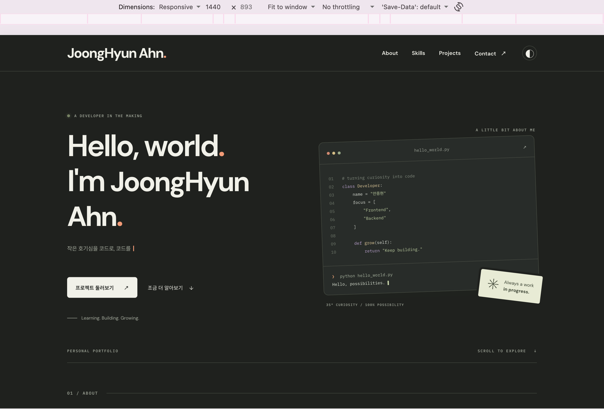
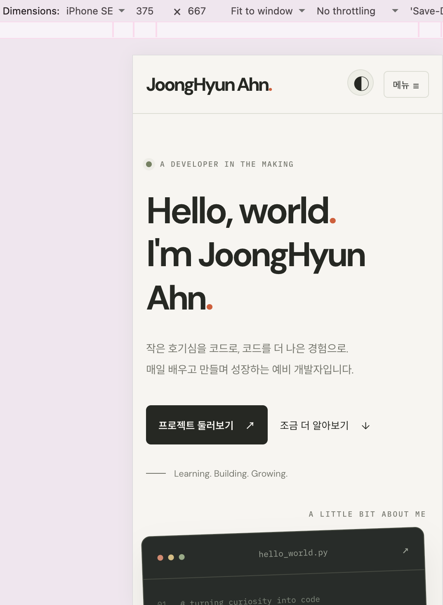
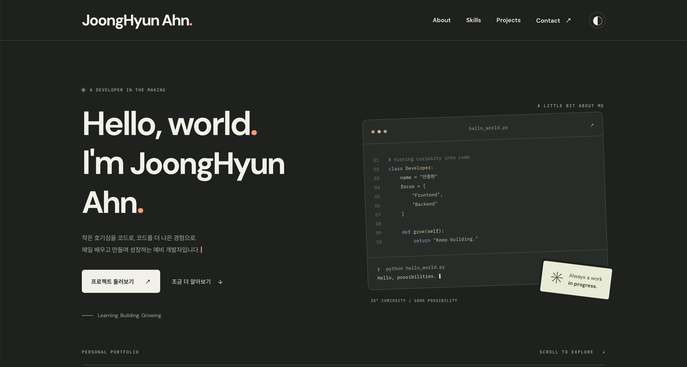

# 나를 소개하는 웹 페이지

HTML, CSS, JavaScript로 만든 반응형 웹 페이지입니다. Hero, About, Skills, Projects, Contact, Footer로 구성하며 GitHub 공개 저장소를 동적으로 표시합니다. 기존 타이핑 효과, 현재 섹션 메뉴 강조, 프로젝트 상세 펼치기도 유지합니다.

## 실행 방법

1. VS Code에서 이 폴더를 엽니다.
2. 확장 프로그램의 추천 항목에서 **Live Server** (`ritwickdey.LiveServer`)를 설치합니다.
3. `index.html`을 우클릭하고 **Open with Live Server**를 선택합니다.
4. 기본 주소는 `http://127.0.0.1:5500`입니다. 파일을 저장하면 화면이 갱신됩니다.

`.vscode/extensions.json`에 추천 확장, `.vscode/settings.json`에 포트 5500과 루트 경로를 설정했습니다. 확장 설치 자체는 사용자의 VS Code에서 진행합니다.

## 사용 기술과 구조

- HTML5 시맨틱 태그, 연결된 label, 의미 있는 alt, ARIA 상태 안내
- CSS 변수, Flexbox, Grid(`auto-fit`, `minmax`), 모바일 퍼스트 미디어 쿼리
- JavaScript ES6+: const/let, 화살표 함수, 템플릿 리터럴, 구조분해, map/forEach
- DOM API, 이벤트, localStorage, IntersectionObserver, fetch, async/await
- GitHub REST API와 GitHub Pages

```text
.
├── index.html
├── css/style.css
├── js/main.js
├── images/profile.svg
├── .vscode/
│   ├── extensions.json
│   └── settings.json
├── .github/workflows/pages.yml
└── README.md
```

프로필 이미지는 제공된 사진 대신 만든 JA 이니셜 SVG입니다. 실제 사진으로 교체하려면 `index.html`의 이미지 경로와 alt를 함께 바꿉니다.

## 기능과 기준값

| 기능                | 구현 기준                                                 |
| ------------------- | --------------------------------------------------------- |
| 모바일 레이아웃     | 기본 스타일, 768px 미만에서 햄버거 메뉴                   |
| 태블릿              | min-width: 768px                                          |
| 데스크톱            | min-width: 1024px                                         |
| 햄버거 메뉴         | 상태 변경 후 `classList.toggle('active', state.menuOpen)` |
| 메뉴 닫기           | 다시 클릭, 메뉴 링크 클릭, 바깥 클릭, Esc, 화면 크기 변경 |
| 부드러운 이동       | CSS `scroll-behavior: smooth`와 섹션 앵커                 |
| 스크롤 탑           | scrollY가 300px 이상이면 표시, 클릭하면 맨 위로 이동      |
| 헤더 배경 변경      | scrollY가 60px 이상이면 `scrolled` 클래스 적용            |
| 다크 모드           | `data-theme`과 `portfolio-theme` localStorage 키          |
| 등장 애니메이션     | IntersectionObserver threshold 0.2, 한 번 실행            |
| 현재 섹션 메뉴 강조 | 별도 Observer, threshold 0, rootMargin -15% 0px -45% 0px  |
| 모션 줄이기         | 운영체제 설정에 따라 타이핑·등장·부드러운 이동 효과 제한  |
| 카드                | hover, transition, box-shadow                             |

## GitHub 프로젝트

요청 주소:

```text
https://api.github.com/users/JoongHyun-codyssey/repos?sort=updated&direction=desc&per_page=6
```

최근 업데이트한 공개 저장소를 최대 6개 조회합니다. 아이디는 `js/main.js`의 `GITHUB_USERNAME`에서 변경합니다. 저장소 이름, 설명, 언어, 스타 수를 표시하고 이름을 클릭하면 GitHub로 이동합니다. 선택 요구사항인 프로젝트 필터는 구현하지 않았습니다.

| 상태    | 화면                                                        |
| ------- | ----------------------------------------------------------- |
| loading | 프로젝트 로딩 중...                                         |
| success | 저장소 카드 목록                                            |
| empty   | 표시할 프로젝트가 없습니다.                                 |
| error   | 프로젝트를 불러올 수 없습니다. + 원인 안내 + 다시 시도 버튼 |

`try/catch`로 오류를 처리하고 15초가 지나면 요청을 취소합니다. 중복 요청을 방지하고, 404·요청 제한·연결 실패를 구분합니다. API 문자열은 이스케이프한 뒤 템플릿 리터럴과 `innerHTML`로 렌더링합니다.

## 상태 → 렌더링

`js/main.js`의 `state` 객체에 상태를 모읍니다.

1. 테마 버튼 → `state.theme` 변경 → `renderTheme()` → 전체 색상 및 버튼 안내 갱신 → localStorage 저장
2. API 호출/재시도 → `state.projects` 변경 → `renderProjects()` → 로딩/성공/에러/빈 화면
3. 폼 input/blur/submit → `state.form.errors`, `touched`, `submitted` 변경 → `renderForm()` → 필드 오류와 성공 안내
4. 메뉴 버튼 → `state.menuOpen` 변경 → `renderMenu()` → 메뉴 표시 및 `aria-expanded` 갱신

## 문의 폼

이름·이메일·메시지의 빈 값과 공백만 입력한 값을 거부하고 이메일 형식을 검사합니다. 입력란을 벗어나거나 제출할 때 검증하며, 이미 검사한 필드는 입력 중 오류를 갱신합니다. 제출 오류가 있으면 첫 오류 필드로 포커스를 이동합니다.

제출은 `event.preventDefault()`로 막고 모든 값이 유효하면 검증 성공 메시지를 표시합니다. **학습용 데모이므로 이메일이나 메시지를 실제로 전송하지 않습니다.**

## 배포

저장소: https://github.com/JoongHyun-codyssey/codyssey_basic_intro_page_B1_1

GitHub Pages URL: https://joonghyun-codyssey.github.io/codyssey_basic_intro_page_B1_1/

## 스크린샷 및 브라우저 검증

| 데스크톱 (1440px) | 모바일 (375px) | 다크 모드 |
| :---: | :---: | :---: |
|  |  |  |
